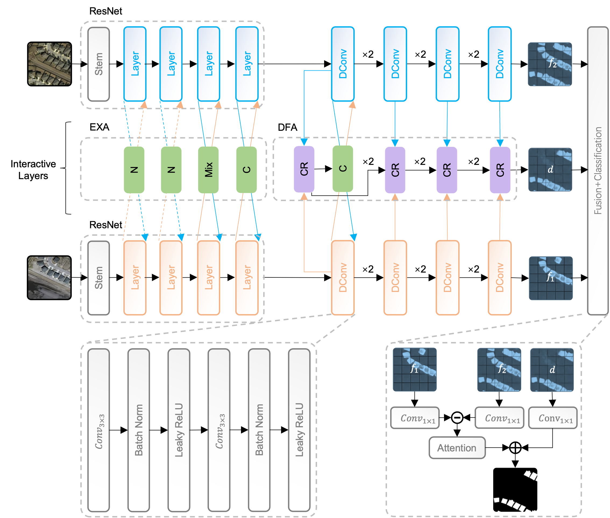

<div align="center">
    <h2>
        FIBTNet: Building Change Detection for Remote Sensing images Using Feature Interactive Bi-temporal Network
    </h2>
</div>
<br>


[](https://github.com/TianWen580/FIBT)
[](LICENSE)

<br>
<br>

<div align="center">

English | [简体中文](README_zh-CN.md)

</div>

## Introduction



This repository contains the code for the paper titled "FIBTNet: Constructing a Change Detection Framework for Remote Sensing Images via a Feature Interactive Bi-temporal Network," which is built upon the MMSegmentation and Open-CD frameworks.

Should you find this project beneficial, we kindly ask you to give it a star ⭐️. Your endorsement serves as our most significant source of inspiration.

## Reliance

FIBTNet base on Open-CD toolbox. Open-CD is an open source change detection toolbox based on a series of open source general vision task tools.

The current version of this branch has been verified to function with PyTorch 2.x and CUDA 12.1, and it is designed to work with Python versions 3.7 and above, offering compatibility with a wide range of CUDA versions.

## News
🌟 6/6/2024 - FIBTNet is publicly available!

## ToDos

- [ ] Support single image demo
- [ ] ...

## Usage

### Dependencies
- Linux or Windows
- Python 3.7+, recommended 3.10
- PyTorch 2.0 or higher, recommended 2.1
- CUDA 11.7 or higher, recommended 12.1
- MMCV 2.0 or higher, recommended 2.1

### Environment Installation

We recommend using Miniconda for installation. The following command will create a virtual environment named ttp and install PyTorch and MMCV.

> Note: If you have experience with PyTorch and have already installed it, you can skip to the next section. Otherwise, you can follow these steps to prepare.

```shell
conda create -n fibt python=3.10 -y
conda activate fibt
```

Then, install PyTorch on Linux/Windows:

```shell
pip install torch==2.1.2 torchvision==0.16.2 torchaudio==2.1.2 --index-url https://download.pytorch.org/whl/cu121
```

Or

```shell
conda install pytorch==2.1.2 torchvision==0.16.2 torchaudio==2.1.2 pytorch-cuda=12.1 -c pytorch -c nvidia
```

### Requirements Installation

Install `MMCV`

```shell
pip install -U openmim
mim install mmcv==2.1.0
```

Install other dependencies.

```shell
pip install -U wandb einops importlib peft==0.8.2 scipy ftfy prettytable torchmetrics==1.3.1 transformers==4.38.1
```

### Install FIBTNet

Download or clone the `fibt` repository.

```shell
git clone git@github.com:TianWen580/FIBT.git
cd fibt
```

## Dataset Preparation

### Levir-CD Change Detection Dataset

#### Dataset Download

- Image and label download address: [Levir-CD](https://chenhao.in/LEVIR/).

#### Organization Method

You can also choose other sources to download the data, but you need to organize the dataset in the following format:

```
${DATASET_ROOT} # Dataset root directory, for example: /home/username/data/levir-cd
├── train
│   ├── A
│   ├── B
│   └── label
├── val
│   ├── A
│   ├── B
│   └── label
└── test
    ├── A
    ├── B
    └── label
```

Note: In the project folder, we provide a folder named `data`, which contains an example of the organization method of the above dataset.

### Other Datasets

If you want to use other datasets, you can refer to [MMSegmentation documentation](https://mmsegmentation.readthedocs.io/zh-cn/latest/user_guides/2_dataset_prepare.html) to prepare the datasets.
</details>

## Model Training

### FIBTNet Model

#### Config File and Main Parameter Parsing

We provide the configuration files of the FIBTNet model used in the paper, which can be found in the `configs/fibt` folder. The Config file is completely consistent with the API interface and usage of MMSegmentation. Below we provide an analysis of some of the main parameters. If you want to know more about the meaning of the parameters, you can refer to [MMSegmentation documentation](https://mmsegmentation.readthedocs.io/zh-cn/latest/user_guides/1_config.html).

#### Single Card Training

```shell
python tools/train.py configs/fibt/xxx.py  # xxx.py is the configuration file you want to use
```

#### Multi-card Training

```shell
sh ./tools/dist_train.sh configs/fibt/xxx.py ${GPU_NUM}  # xxx.py is the configuration file you want to use, GPU_NUM is the number of GPUs used
```
## Model Testing

#### Single Card Testing:

```shell
python tools/test.py configs/fibt/xxx.py ${CHECKPOINT_FILE}  # xxx.py is the configuration file you want to use, CHECKPOINT_FILE is the checkpoint file you want to use
```

#### Multi-card Testing:

```shell
sh ./tools/dist_test.sh configs/fibt/xxx.py ${CHECKPOINT_FILE} ${GPU_NUM}  # xxx.py is the configuration file you want to use, CHECKPOINT_FILE is the checkpoint file you want to use, GPU_NUM is the number of GPUs used
```

**Note**: If you need to get the visualization results, you can uncomment `default_hooks-visualization` in the Config file.

## Image Prediction

#### Single Image Prediction:

todo...


## Citation

If you find this project useful in your research, please consider cite:

<!-- ```bibtex
@ARTICLE{10438490,
  author={Li, Kaiyu and Cao, Xiangyong and Meng, Deyu},
  journal={IEEE Transactions on Geoscience and Remote Sensing}, 
  title={A New Learning Paradigm for Foundation Model-based Remote Sensing Change Detection}, 
  year={2024},
  volume={},
  number={},
  pages={1-1},
  keywords={Adaptation models;Task analysis;Data models;Computational modeling;Feature extraction;Transformers;Tuning;Change detection;foundation model;visual tuning;remote sensing image processing;deep learning},
  doi={10.1109/TGRS.2024.3365825}}

@ARTICLE{10129139,
  author={Fang, Sheng and Li, Kaiyu and Li, Zhe},
  journal={IEEE Transactions on Geoscience and Remote Sensing}, 
  title={Changer: Feature Interaction is What You Need for Change Detection}, 
  year={2023},
  volume={61},
  number={},
  pages={1-11},
  doi={10.1109/TGRS.2023.3277496}}
``` -->

## License

FIBTNet is released under the Apache 2.0 license.
